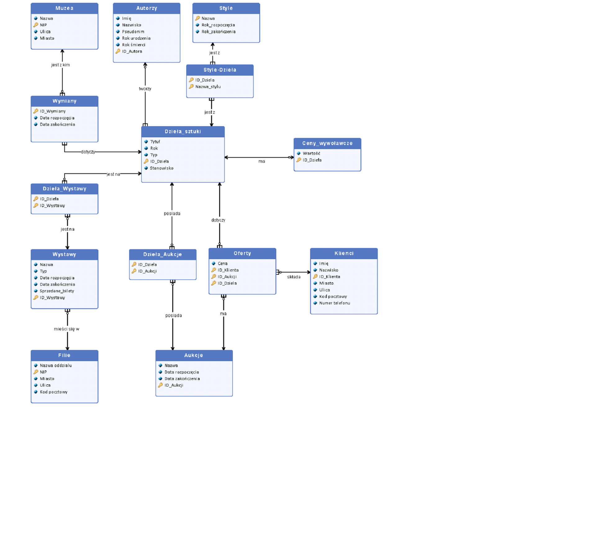

# Database-for-museum
University project for relational dabatase comprehension and learning SQL.

# Purpose of the database
The aim of the database is to facilitate the management of the exhibition of works at the Museum
of Art, the sending of works from the Museum of Art on loan to another museum, as well as the
sale of works of art in the auction house run by the Museum.

Thorough information about the database structure can be found in: DATABASE_DESCRIPTION_(language).pdf files.
The strictire of the database is as follows:

# Contents of the repository

## Scripts folder
The scripts folder consists of 4 scripts: 
1. To create the database
2. To drop the database
3. Inserting data to the database
4. Deleting data from the database

## Queries folder
The queries folder consists of 10 queries to the database. Each starts with an explanation of what the query is aiming to in the front lines of the file.

   
